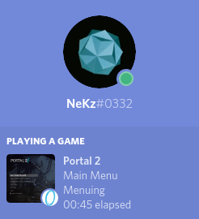

## Supported Systems

- Linux

## Detection

The order matters.

### Details

- Demo Player
- Puzzle Maker
- Main Menu
- Challenge Mode
- Cooperative
- Single Player
- Extras
- Workshop

### States

- Rendering
- Viewing
- Mapping
- Menuing
- Routing
- Grinding
- Running
- Playing

## Connection

This plugin detects automatically your [board.iverb.me](https://board.iverb.me) profile by your logged in Steam account. Global rank will be fetch from [aggregated rankings](https://board.iverb.me). Level ranking will be fetched from current chamber.

It does not update the rankings frequently. Global rank will be determined once the plugin has loaded successfully. The ranking of a current chamber will be updated when the level changes.

## Building

Game is x86 only, probably want to remember how to build this sht again lmao.

|Dependency|Configuration|
|---|---|
|[discord-rpc](https://github.com/discordapp/discord-rpc)|set_target_properties(discord-rpc PROPERTIESCOMPILE_FLAGS "-m32" LINK_FLAGS "-m32")|
|[openssl](https://github.com/openssl/openssl)|-m32 linux-generic32|
|[curl](https://github.com/curl/curl)|--with-ssl --host=i686-linux-gnu --build=i686-linux-gnu CC="gcc -m32" CXX="g++ -m32" CFLAGS="-O2 -march=i686" CXXFLAGS="-O2 -march=i686"|
|[restclient-cpp](https://github.com/mrtazz/restclient-cpp)|Same as above without the ssl part.|
|[json](https://github.com/nlohmann/json)|Single include.|

## Credits

